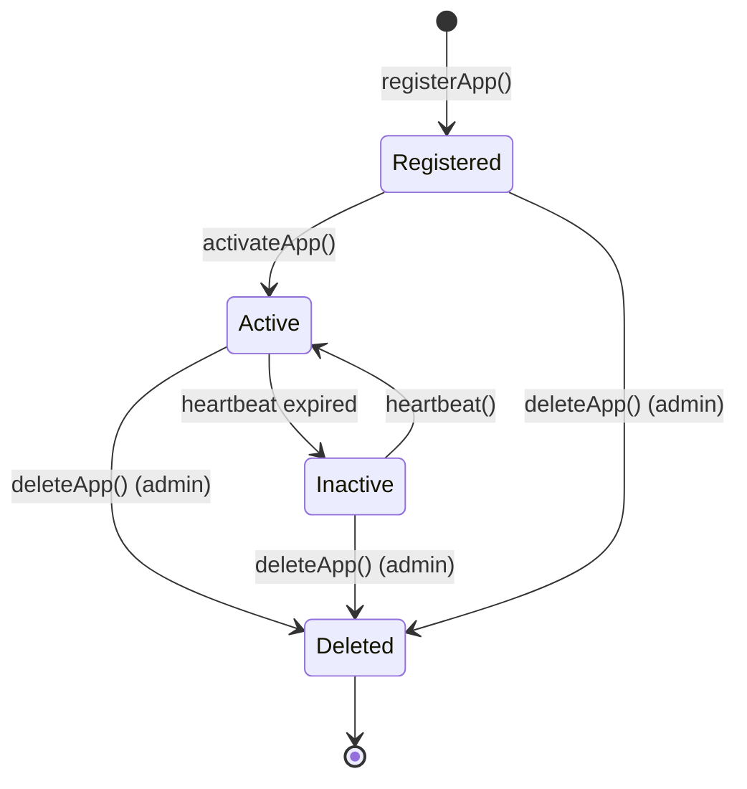

# Nova TEE Platform - Smart Contract Wallet System

A comprehensive on-chain contract system for the Nova TEE (Trusted Execution Environment) platform, enabling secure execution of Web 3.0 applications inside AWS Nitro Enclaves with blockchain integration via EIP-4337 account abstraction.

## Overview

The Nova platform allows developers to deploy decentralized applications that run inside AWS Nitro Enclaves - hardware-based trusted execution environments. Each application instance gets its own EIP-4337 smart contract wallet, with gas costs sponsored by the Nova platform through a Paymaster mechanism.

### Key Features

- **🔐 Multi-TEE Support**: Supports AWS Nitro Enclaves, Intel SGX, and AMD SEV-SNP with pluggable verifiers
- **🔗 Version Chains**: Semantic versioning with budget migration for seamless app upgrades
- **📦 PCR-Based App Grouping**: Apps with identical Platform Configuration Registers (PCRs) are automatically grouped
- **💳 EIP-4337 Account Abstraction**: Each app gets a smart contract wallet with sponsored gas
- **🔄 Dual Control Mechanism**: Operators control business logic, Nova platform manages infrastructure
- **❤️ Batch Heartbeat Monitoring**: Gas-optimized liveness tracking (83% gas savings for 1000 apps)
- **🧹 Bounded Storage**: Automatic cleanup of expired attestations (7-day retention)
- **⬆️ Upgradeable Architecture**: UUPS proxy pattern for platform upgrades
- **🔒 Replay Protection**: Attestation and nonce-based protection against replay attacks

## Architecture

### Core Components

```
┌─────────────────────────────────────────────────────────────┐
│                      Nova Platform                          │
├─────────────────────────────────────────────────────────────┤
│                                                             │
│  ┌───────────────┐      ┌──────────────┐                  │
│  │ NovaRegistry  │◄─────┤  Attestation │                  │
│  │   (UUPS)      │      │   Verifier   │                  │
│  └───────┬───────┘      └──────────────┘                  │
│          │                                                 │
│          ├─────────► AppWalletFactory                     │
│          │                                                 │
│          └─────────► NovaPaymaster (EIP-4337)             │
│                                                             │
└─────────────────────────────────────────────────────────────┘
                       │
                       ▼
         ┌─────────────────────────┐
         │    App Contracts        │
         │  (INovaApp Interface)   │
         └─────────────────────────┘
                       │
                       ▼
         ┌─────────────────────────┐
         │  AppWallet (EIP-4337)   │
         │   Smart Contract        │
         └─────────────────────────┘
```

### Contract Breakdown

| Contract | Purpose | Upgradeability |
|----------|---------|----------------|
| **NovaRegistry** | Main platform contract managing app lifecycle | UUPS Upgradeable |
| **AppWalletFactory** | Deploys EIP-4337 wallets using CREATE2 | Non-upgradeable |
| **NovaPaymaster** | Sponsors gas for app operations | Non-upgradeable |
| **AppWallet** | EIP-4337 smart contract wallet for apps | Operator-replaceable |
| **ExampleApp** | Reference implementation of INovaApp | Non-upgradeable |

## Quick Start

### Prerequisites

- Foundry installed ([installation guide](https://book.getfoundry.sh/getting-started/installation))
- Base Sepolia testnet RPC URL
- BaseScan API key for contract verification

### Installation

```bash
# Clone the repository
git clone <repository-url>
cd smart-contract-wallet

# Install dependencies (via git submodules)
forge install

# Build contracts
forge build
```

### Deployment

See [DEPLOYMENT.md](docs/DEPLOYMENT.md) for detailed deployment instructions.

## Deployment Flow

Here's how an application gets deployed and activated on the Nova platform:

### 1. Publisher Deploys App Contract

```solidity
// Publisher deploys their app contract
ExampleApp app = new ExampleApp(publisherAddress, novaRegistryAddress);
app.initialize(pcr0, pcr1, pcr2);
```

### 2. Publisher Registers App with Nova

```solidity
// Register app with Nova platform (v1.0.0)
novaRegistry.registerApp(
    address(app), 
    pcr0, pcr1, pcr2, 
    bytes32(0), // No previous version
    "v1.0.0"    // Semantic version
);
```

At this point, the app is in `Registered` status, waiting for activation.

### 3. Publisher Deploys App to Enclave

The publisher uses Nova platform tooling to:
- Package the application
- Deploy to AWS Nitro Enclave
- App generates temporary wallet address and private key inside the enclave

### 4. Nova Platform Activates App

The Nova platform:
- Obtains attestation report from the enclave (contains PCRs, ETH address, TLS pubkey)
- Generates zero-knowledge proof of the attestation
- Calls `activateApp()` with the proof

```solidity
// Nova platform activates the app
// Nova platform activates the app
novaRegistry.activateApp(
    address(app),
    TEEType.NitroEnclave,
    attestationOutput,
    zkProof
);
```

The contract:
- Verifies the ZK proof
- Validates PCRs match registered values
- Extracts ETH address from attestation
- Sets operator in the app contract
- Updates status to `Active`

### 5. Wallet Deployment

```solidity
// Deploy EIP-4337 wallet for the app
address wallet = walletFactory.createWallet(
    address(app),
    operatorAddress,
    salt
);
```

### 6. Gas Budget Funding

Anyone can fund the app's gas budget:

```solidity
// Fund app gas budget
novaRegistry.fundApp{value: 1 ether}(address(app));
```

### 7. App Operations

The app can now execute UserOperations through its wallet, with gas sponsored by the Paymaster:

```solidity
// App submits UserOperation through EIP-4337 EntryPoint
// Paymaster validates and sponsors gas
// Gas cost is deducted from app's budget in NovaRegistry
```

### 8. Heartbeat Updates

The Nova platform periodically updates heartbeats:

```solidity
// Nova platform updates heartbeat
novaRegistry.heartbeat(address(app));
```

If heartbeat expires (default: 24 hours), app status changes to `Inactive`.

## App Instance States



## PCR-Based App Grouping

Apps with identical PCRs (Platform Configuration Registers) share the same `appId`:

```solidity
appId = keccak256(abi.encodePacked(pcr0, pcr1, pcr2))
```

This allows:
- Multiple instances of the same application code
- Easy discovery of all instances running the same code
- Version tracking across instances

Example:

```solidity
// Query all instances running the same code
address[] memory instances = novaRegistry.getAppsByPCRs(pcr0, pcr1, pcr2);
```

## Gas Budget Management

Each app instance has its own gas budget:

```solidity
struct AppInstance {
    uint256 gasUsed;      // Total gas consumed (wei)
    uint256 gasBudget;    // Remaining gas budget (wei)
    // ... other fields
}
```

**Funding**: Anyone can fund an app's budget
```solidity
novaRegistry.fundApp{value: amount}(appContract);
```

**Consumption**: Automatically deducted by Paymaster
```solidity
// Paymaster deducts gas after each UserOperation
novaRegistry.deductGas(appContract, gasCost);
```

**Tracking**: Query current budget and usage
```solidity
AppInstance memory instance = novaRegistry.getAppInstance(appContract);
uint256 remaining = instance.gasBudget;
uint256 used = instance.gasUsed;
```

## Implementing INovaApp

To create a Nova-compatible app contract, implement the `INovaApp` interface:

```solidity
contract MyApp is INovaApp {
    address public immutable override publisher;
    address public override novaPlatform;
    
    bytes32 public override pcr0;
    bytes32 public override pcr1;
    bytes32 public override pcr2;
    
    constructor(address _publisher, address _novaPlatform) {
        publisher = _publisher;
        novaPlatform = _novaPlatform;
    }
    
    function initialize(bytes32 _pcr0, bytes32 _pcr1, bytes32 _pcr2) 
        external override 
    {
        require(msg.sender == publisher, "Unauthorized");
        require(pcr0 == bytes32(0), "Already initialized");
        pcr0 = _pcr0;
        pcr1 = _pcr1;
        pcr2 = _pcr2;
    }
    
    function updatePlatform(address _novaPlatform) external override {
        require(msg.sender == publisher, "Unauthorized");
        novaPlatform = _novaPlatform;
    }

    // Your business logic here
}
```

See [ExampleApp.sol](app-contracts/examples/ExampleApp.sol) for a complete reference implementation.

## Security Considerations

### Attestation Verification

- All app activations require valid ZK proofs of AWS Nitro Enclave attestations
- PCRs must match pre-registered values
- Attestation timestamps are validated

### Access Control

- **Admin Role**: Can delete apps and upgrade NovaRegistry
- **Platform Role**: Can activate apps and update heartbeats  
- **Paymaster Role**: Can deduct gas from app budgets
- **Publisher**: Can register apps and update PCRs
- **Operator**: Can execute UserOperations via wallet

### Operator Replacement

When a new enclave instance starts with valid attestation:
- Old operator is automatically replaced
- Old wallet is deprecated (temporary wallets)
- New operator gets control immediately

## Testing

```bash
# Run tests
forge test

# Run tests with gas reporting
forge test --gas-report

# Run specific test file
forge test --match-path test/NovaRegistry.t.sol
```

## Contributing

Contributions are welcome! Please see [CONTRIBUTING.md](CONTRIBUTING.md) for guidelines.

## License

Apache-2.0 - see [LICENSE](LICENSE) for details.

## Documentation

- [API.md](docs/API.md) - Complete API reference for all contracts
- [DEVELOPER_GUIDE.md](docs/DEVELOPER_GUIDE.md) - Step-by-step guide for app developers
- [DEPLOYMENT.md](docs/DEPLOYMENT.md) - Deployment guide for Base Sepolia
- [DESIGN.md](docs/DESIGN.md) - Architecture and design decisions
- [PROJECT.md](PROJECT.md) - Project structure and organization

## Support

For questions and support, please open an issue on GitHub.