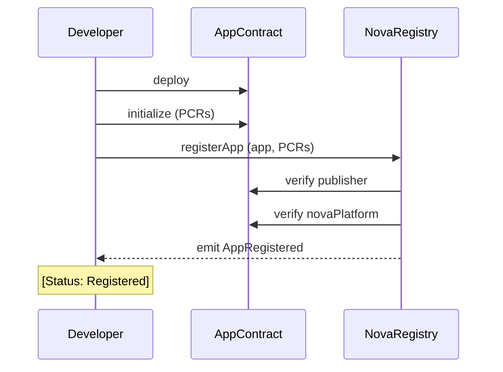
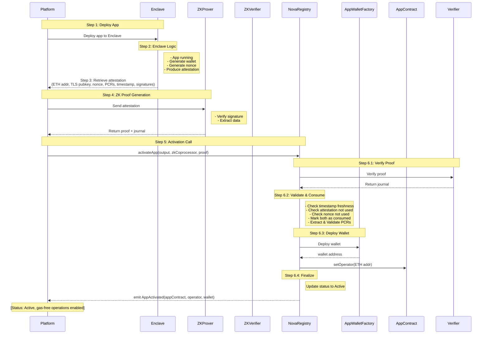
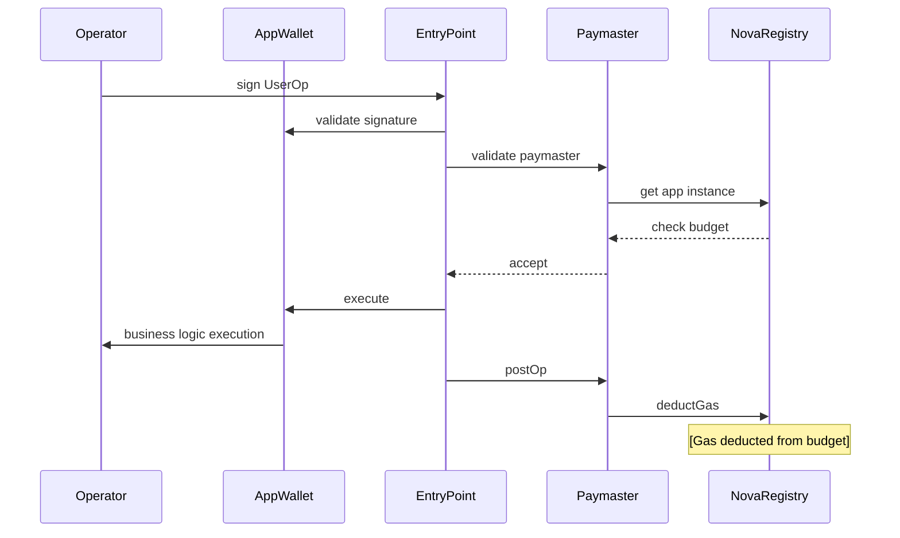
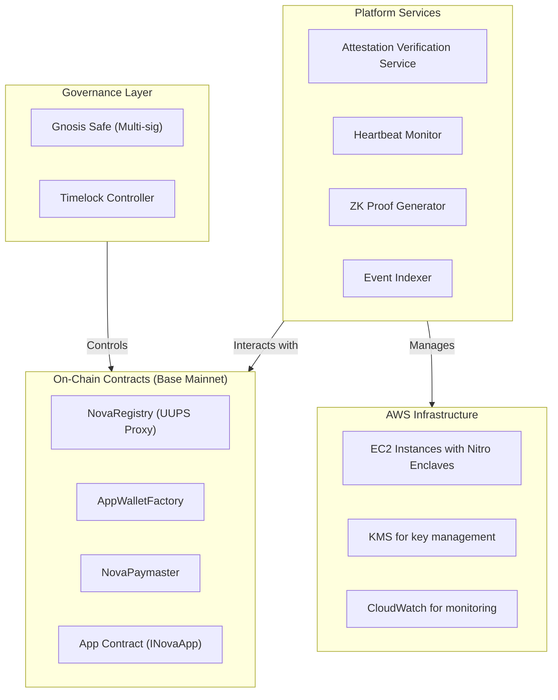

# Nova TEE Platform - System Design Overview

## Executive Summary

The Nova TEE Platform is an innovative infrastructure that bridges **Trusted Execution Environments (TEE)** with **blockchain technology** to enable secure, verifiable, and user-friendly Web 3.0 applications. By combining AWS Nitro Enclaves with zero-knowledge proofs and EIP-4337 account abstraction, the platform provides:

- **Verifiable Computation**: All application instances are cryptographically verified
- **Gas Abstraction**: Users never pay gas fees directly
- **Automatic Grouping**: Apps running the same code are automatically discovered
- **Dual Control**: Clear separation between business logic and infrastructure management

## Problem Statement

### Challenges in TEE-Blockchain Integration

1. **Attestation Verification**: How to verify enclave attestations on-chain efficiently?
2. **Identity Management**: How to associate ephemeral enclave wallets with applications?
3. **Gas Costs**: How to provide seamless UX without users paying gas?
4. **Liveness Monitoring**: How to track if enclave instances are still running?
5. **Upgradability**: How to evolve the platform without breaking existing apps?

### Nova's Solutions

| Challenge | Solution |
|-----------|----------|
| Attestation Verification | Zero-knowledge proofs of Nitro attestations |
| Identity Management | PCR-based app grouping + operator registration |
| Gas Costs | EIP-4337 Paymaster with per-app budgets |
| Liveness Monitoring | Configurable heartbeat mechanism |
| Upgradability | UUPS proxy pattern for platform contracts |

## Architecture Overview

```
┌──────────────────────────────────────────────────────────────┐
│                    AWS Nitro Enclave                          │
│  ┌────────────────────────────────────────────────────┐      │
│  │  User Application                                  │      │
│  │  - Generates temporary wallet keypair             │      │
│  │  - Produces attestation report                    │      │
│  │  - Signs UserOperations                           │      │
│  └────────────────────────────────────────────────────┘      │
└──────────────────────────────────────────────────────────────┘
                            ↓
                    [Attestation Report]
                            ↓
┌──────────────────────────────────────────────────────────────┐
│               Nova Platform (Off-Chain)                       │
│  - Obtains attestation from enclave                          │
│  - Generates ZK proof via coprocessor                        │
│  - Calls on-chain contracts                                  │
│  - Monitors heartbeat                                        │
└──────────────────────────────────────────────────────────────┘
                            ↓
                   [ZK Proof + Attestation]
                            ↓
┌──────────────────────────────────────────────────────────────┐
│              On-Chain Contracts (Base Sepolia)                │
│                                                               │
│  ┌─────────────────┐                                         │
│  │  NovaRegistry   │  ← Verifies ZK proofs                  │
│  │   (UUPS Proxy)  │  ← Manages app lifecycle               │
│  └────────┬────────┘  ← Tracks gas budgets                  │
│           │                                                   │
│           ├──────────► AppWalletFactory                      │
│           │            (Deploys EIP-4337 wallets)            │
│           │                                                   │
│           └──────────► NovaPaymaster                         │
│                        (Sponsors gas for apps)               │
│                                                               │
│  ┌─────────────────┐         ┌──────────────────┐          │
│  │   App Contract  │◄───────┤   AppWallet      │          │
│  │  (INovaApp)     │         │   (EIP-4337)     │          │
│  └─────────────────┘         └──────────────────┘          │
└──────────────────────────────────────────────────────────────┘
```

## Key Design Decisions

### 1. PCR-Based App Grouping

**Decision**: Use `keccak256(pcr0, pcr1, pcr2)` as app identifier

**Rationale**:
- Enables automatic discovery of instances running the same code
- Allows multiple developers to deploy the same app independently
- Provides version tracking without central coordination

**Trade-offs**:
- Apps with different PCRs (even minor code changes) get different IDs
- Requires PCR update mechanism for app upgrades

### 2. UUPS Over Transparent Proxy

**Decision**: Use UUPS (Universal Upgradeable Proxy Standard)

**Rationale**:
- Lower gas costs (upgrade logic in implementation)
- Smaller proxy contract
- Cleaner separation of concerns

**Trade-offs**:
- Implementation must include upgrade logic
- Risk of bricking if upgrade logic has bugs (mitigated by testing)

### 3. Separate Wallet Factory

**Decision**: Deploy wallet factory as separate contract

**Rationale**:
- Single responsibility principle
- Reusable across different apps
- CREATE2 for deterministic addresses

**Trade-offs**:
- Additional deployment step
- Extra transaction for wallet deployment

### 4. Dual Control Model

**Decision**: Operator controls execution, Nova platform controls operator

**Rationale**:
- Clear separation of concerns
- Operator can't lock out platform
- Platform can replace compromised operators

**Trade-offs**:
- Requires platform to act honestly
- Operator replacement needs new wallet (temporary wallets acceptable)

### 5. Heartbeat Mechanism

**Decision**: Configurable heartbeat with lazy inactive marking

**Rationale**:
- Flexible for different app requirements
- Gas-efficient (on-demand checks)
- Allows reactivation

**Trade-offs**:
- Requires off-chain monitoring
- Apps can appear active longer than they are (until check)

## Data Flow Diagrams

### App Registration Flow



### App Activation Flow

This is the critical process where an application deployed in AWS Nitro Enclave gets registered and verified on-chain.

#### Detailed Step-by-Step Process



#### Activation Flow Breakdown

**Step 1: Deploy App to Enclave**
- Nova Platform deploys application code to AWS Nitro Enclave
- Enclave boots up and starts running the application
- App runs in isolated environment with hardware-level protection

**Step 2: Enclave Generates Credentials and Attestation**

All operations happen **inside the Enclave**:

1. **Generate Ephemeral Wallet**
   - App generates temporary ECDSA keypair
   - Private key stored securely in enclave memory (never exported)
   - Public key derived to Ethereum address

2. **Generate Unique Nonce**
   - 32 bytes cryptographically secure random value
   - Ensures attestation uniqueness and prevents replay attacks
   - Will be embedded in attestation document

3. **Produce Attestation**
   - Enclave requests attestation from AWS Nitro hardware
   - Attestation document contains:
     - ETH wallet address
     - TLS public key
     - Nonce (for replay protection)
     - PCR0, PCR1, PCR2 (code measurements)
     - Timestamp (when attestation was generated)
     - Full cryptographic proof signed by AWS Nitro
   - Attestation is ready for Platform to retrieve

**Step 3: Platform Retrieves Attestation**
- Platform retrieves the attestation document from enclave
- Attestation is a complete, signed document from AWS Nitro hardware
- Contains all necessary data:
  - `ETH wallet address` - Identity of app instance
  - `TLS public key` - For secure communication
  - **`Nonce`** - Unique random value for replay protection
  - `PCR0, PCR1, PCR2` - Code measurements
  - `Timestamp` - Generation time (milliseconds)
  - `Certificate chain` - AWS root to leaf certificates
  - `Signature` - AWS Nitro hardware signature
- Platform now has attestation ready to send for ZK proof generation

**Step 4: ZKProver Generates Zero-Knowledge Proof**
- Platform sends the attestation document to **ZKProver**
  - ZKProver can be RISC Zero or Succinct SP1
  - ZKProver is **only responsible** for generating ZK proof

- ZKProver processes the attestation:
  1. Verifies AWS Nitro attestation signature
  2. Validates certificate chain (root to leaf)
  3. Checks timestamp is reasonable
  4. Extracts public data (ETH address, nonce, PCRs, etc.)
  5. Generates zero-knowledge proof of the above

- Returns to Platform:
  - **Proof bytes**: Compressed ZK proof
  - **Journal (public outputs)**: Extracted data that can be verified on-chain
    - ETH address
    - TLS public key hash
    - Nonce
    - PCR0, PCR1, PCR2
    - Timestamp
    - Certificate hashes

**Step 5: Call activateApp**
- Platform submits transaction to NovaRegistry with:
  - `appContract` - Address of registered app
  - `output` - Encoded VerifierJournal
  - `zkCoprocessor` - Type of ZK system used
  - `proofBytes` - ZK proof data

**Step 6.1: Verify ZK Proof**
```solidity
VerifierJournal memory journal = verifier.verify(
    output,
    zkCoprocessor,
    proofBytes
);
```
- NovaRegistry calls INitroEnclaveVerifier
- Verifier validates proof against configured verifier contract
- Verifier checks certificate chain against trusted roots
- Verifier validates attestation timestamp (within maxTimeDiff)

**Step 6.2: Replay Protection & Data Validation**

**Anti-Replay Validation:**
```solidity
_validateAndConsumeAttestation(journal, appContract);
```
Multi-layer replay protection:
1. **Timestamp Check**: Attestation must be within 5-minute validity window
   - Rejects if older than 5 minutes (`AttestationExpired`)
   - Rejects if more than 1 minute in future (`AttestationFromFuture`)
2. **Attestation Hash Check**: Compute unique hash of entire attestation
   - Hash includes: timestamp, nonce, userData, publicKey, moduleId, PCRs, certs
   - Check if hash already used (`AttestationAlreadyUsed`)
3. **Nonce Check**: Verify nonce not previously used (`NonceAlreadyUsed`)
4. **Mark as Consumed**: Store both attestation hash and nonce hash
5. **Emit Event**: `AttestationConsumed(appContract, attestationHash, nonceHash, timestamp)`

**Data Extraction & PCR Validation:**
```solidity
(address ethAddress, bytes32 tlsPubkeyHash, bytes32 pcr0, bytes32 pcr1, bytes32 pcr2) 
    = journal.extractAttestationData();

journal.validatePCRs(metadata.pcr0, metadata.pcr1, metadata.pcr2);
```
- Extract verified data from journal (ETH address, TLS key, PCRs)
- Compare PCRs against values registered by developer
- Ensures enclave is running approved code
- Any mismatch causes transaction revert

**Step 6.3: Deploy Smart Contract Wallet**
```solidity
instance.operator = ethAddress;
instance.walletAddress = address(0); // Placeholder, updated when wallet deployed
INovaApp(appContract).setOperator(ethAddress);
```
- Register operator (enclave's ETH address) in AppInstance
- Call app contract to set operator (for app's own logic)
- Factory deploys EIP-4337 AppWallet (via CREATE2 for deterministic address)
- Wallet configured with operator for signature validation

**Step 6.4: Finalize Activation**
- Update instance status: `Registered → Active`
- Set `lastHeartbeat = block.timestamp`
- Emit `AppActivated` event
- App can now execute gas-free UserOperations via Paymaster

### UserOperation Execution Flow



## Security Architecture

### Trust Boundaries

```
┌─────────────────────────────────────────┐
│   Trusted Components                    │
│   - AWS Nitro Enclave hardware         │
│   - ZK Verifier contract                │
│   - EIP-4337 EntryPoint                 │
└─────────────────────────────────────────┘

┌─────────────────────────────────────────┐
│   Semi-Trusted Components               │
│   - Nova Platform (PLATFORM_ROLE)       │
│     Can: Activate apps, heartbeat       │
│     Cannot: Modify app data, steal funds│
└─────────────────────────────────────────┘

┌─────────────────────────────────────────┐
│   Untrusted Components                  │
│   - App developers                      │
│   - App operators                       │
│   - General users                       │
└─────────────────────────────────────────┘
```

### Attack Surface Analysis

| Component | Attack Vector | Mitigation |
|-----------|--------------|------------|
| NovaRegistry | Fake attestation | ZK proof verification |
| NovaRegistry | Attestation replay | Multi-layer replay protection (nonce + hash + time) |
| NovaRegistry | PCR manipulation | Attestation validation |
| Paymaster | Unauthorized sponsorship | Budget checks, wallet verification |
| AppWallet | Signature forgery | ECDSA verification |
| App Contract | Unauthorized operator | Platform-only setOperator |

### Cryptographic Guarantees

1. **Attestation Authenticity**: ZK proof ensures attestation is from real Nitro Enclave
2. **PCR Integrity**: PCRs in attestation must match registered values
3. **Operator Identity**: ETH address extracted from verified attestation
4. **Operation Authorization**: ECDSA signature from registered operator
5. **Replay Protection**: Multi-layer defense prevents attestation reuse
   - Unique nonce per attestation
   - Full attestation hash tracking
   - Time-bounded validity (5 minutes)
   - Dual verification (hash + nonce)

## Potential Security Issues and Mitigations

### 🔴 Critical Issues

#### 1. Attestation Replay Attack ✅ **IMPLEMENTED**

**Problem**: Same attestation could potentially be used multiple times to activate different app instances.

**Risk**: Attacker could reuse a valid attestation to activate malicious apps.

**Implementation Status**: ✅ **SOLVED** (v2.0.0)

**Current Protection (Multi-Layer Defense)**:
```solidity
// 1. Track used attestations
mapping(bytes32 => bool) private _usedAttestations;
mapping(bytes32 => bool) private _usedNonces;

// 2. Validate and consume attestation
function _validateAndConsumeAttestation(journal, appContract) {
    // Check timestamp (5 minute validity window)
    _validateAttestationTimestamp(journal.timestamp);
    
    // Compute unique hash (includes nonce, timestamp, all data)
    bytes32 attestationHash = _computeAttestationHash(journal);
    
    // Check if already used
    if (_usedAttestations[attestationHash]) {
        revert AttestationAlreadyUsed();
    }
    
    // Check nonce separately (extra layer)
    bytes32 nonceHash = keccak256(journal.nonce);
    if (_usedNonces[nonceHash]) {
        revert NonceAlreadyUsed();
    }
    
    // Mark as used
    _usedAttestations[attestationHash] = true;
    _usedNonces[nonceHash] = true;
    
    emit AttestationConsumed(appContract, attestationHash, nonceHash, timestamp);
}
```

**Protection Layers**:
1. ✅ **Nonce Uniqueness**: Each attestation contains unique 32-byte random nonce
2. ✅ **Hash Tracking**: Full attestation hash prevents any reuse
3. ✅ **Time Validation**: 5-minute validity window + 1-minute clock drift tolerance
4. ✅ **Dual Verification**: Both hash and nonce checked independently

**Prevented Attack Scenarios**:
- ✅ Same attestation replayed for different app
- ✅ Same nonce used with different attestation data
- ✅ Old leaked attestation reused after time window
- ✅ Pre-generated future attestation

**References**: 
- Implementation: `nova-contracts/core/NovaRegistry.sol`
- Tests: `test/NovaRegistry.replay.t.sol`
- Documentation: `docs/ATTESTATION_REPLAY_PROTECTION.md`

#### 2. Ephemeral Private Key Compromise

**Problem**: If enclave is compromised, attacker gains full control of operator private key.

**Risk**: Complete control over app's on-chain operations until operator is rotated.

**Current Mitigation**:
- Platform can call `updateOperator()` to rotate keys
- Hardware-level enclave protection

**Recommended Enhancement**:
- Implement automatic key rotation every N hours/days
- Add multi-signature requirement for critical operations
- Implement spending limits per time period

```solidity
// Add operator rotation mechanism
struct OperatorSchedule {
    address currentOperator;
    address nextOperator;
    uint256 rotationTimestamp;
}

function scheduleOperatorRotation(address newOperator, uint256 delay) external;
function executeOperatorRotation(address appContract) external;
```

#### 3. PCR Timing Race Condition

**Problem**: If app updates PCRs between registration and activation, activation will fail.

**Risk**: DoS attack by updating PCRs immediately after registration.

**Current Mitigation**:
- Only publisher or app contract can update PCRs
- Requires explicit call to `updatePCRs()`

**Recommended Enhancement**:
```solidity
// Add PCR version tracking
struct PCRHistory {
    bytes32 pcr0;
    bytes32 pcr1;
    bytes32 pcr2;
    uint256 validFrom;
    uint256 validUntil;
}

// Allow activation with any valid PCR version within time window
mapping(bytes32 => PCRHistory[]) private _pcrHistory;
```

### ⚠️ High-Severity Issues

#### 4. Nova Platform Single Point of Failure

**Problem**: Platform has exclusive control over activation and heartbeat.

**Risk**: 
- Platform compromise → System-wide breach
- Platform downtime → All apps become inactive
- Platform censorship → Selective app blocking

**Current Mitigation**:
- Role-based access control (PLATFORM_ROLE)
- Platform cannot directly steal funds

**Recommended Enhancement**:
```solidity
// Add multi-platform support
mapping(address => bool) public authorizedPlatforms;

modifier onlyAuthorizedPlatform() {
    require(authorizedPlatforms[msg.sender], "Unauthorized platform");
    _;
}

// Allow app self-heartbeat as fallback
function selfHeartbeat(bytes calldata attestationProof) external {
    // Verify caller is app's current operator
    // Validate fresh attestation
    // Update heartbeat
}
```

#### 5. Gas Budget Exhaustion DoS

**Problem**: When app's gasBudget reaches zero, all operations fail with no fallback.

**Risk**: Service disruption, user experience degradation.

**Current Mitigation**:
- `fundApp()` allows anyone to add funds
- Events emitted for monitoring

**Recommended Enhancement**:
```solidity
// Add budget threshold alerts and auto-refill
struct BudgetConfig {
    uint256 lowThreshold;
    uint256 autoRefillAmount;
    address refillSource;
}

mapping(address => BudgetConfig) private _budgetConfigs;

function checkAndRefill(address appContract) internal {
    AppInstance storage instance = _appInstances[appContract];
    BudgetConfig memory config = _budgetConfigs[appContract];
    
    if (instance.gasBudget < config.lowThreshold) {
        // Trigger alert event
        emit BudgetLow(appContract, instance.gasBudget);
        
        // Auto-refill if configured
        if (config.refillSource != address(0)) {
            // Pull funds from treasury/reserve
        }
    }
}
```

### 📊 Medium-Severity Issues

#### 6. Operator Address Immutability After Enclave Restart

**Problem**: Enclave restart generates new ephemeral keypair, but on-chain operator not updated.

**Risk**: All UserOperations fail until platform calls `updateOperator()`.

**Mitigation Strategy**:
- Platform monitors enclave restarts
- Automatic operator rotation flow
- Temporary grace period for old operator

#### 7. Missing Gas Consumption Auditing

**Problem**: Only total budget tracked, no per-operation consumption logs.

**Risk**: Difficult to detect abuse or optimize costs.

**Recommended Enhancement**:
```solidity
// Detailed gas tracking
event GasConsumed(
    address indexed appContract,
    address indexed operator,
    uint256 amount,
    bytes32 userOpHash,
    uint256 timestamp
);

// Add gas analytics
struct GasStats {
    uint256 totalConsumed;
    uint256 operationCount;
    uint256 avgGasPerOp;
    uint256 lastResetTimestamp;
}
```

#### 8. Heartbeat Reliability Dependency

**Problem**: Heartbeat depends entirely on platform's off-chain monitoring.

**Risk**: Network issues or platform bugs cause false inactive status.

**Recommended Enhancement**:
- Implement on-chain self-heartbeat capability
- Allow operator to send heartbeat with fresh attestation proof
- Add heartbeat grace period before marking inactive

### 🛡️ Best Practices and Recommendations

#### Immediate Actions (Priority 1) ✅ **COMPLETED**

1. ✅ **Implement Attestation Replay Protection** - **DONE (v2.0.0)**
   - ✅ Track used attestations by hash
   - ✅ Track used nonces separately
   - ✅ Add timestamp validation window (5 minutes)
   - ✅ Multi-layer defense implemented
   - **Status**: Fully implemented in NovaRegistry
   - **Gas Cost**: +47k (~15% increase)
   - **Security**: Industrial-grade protection

2. 🔄 **Add Operator Key Rotation** - **PLANNED**
   - Scheduled rotation mechanism
   - Emergency rotation capability
   - Grace period for key transitions
   - **Status**: Design phase

3. 🔄 **Implement Budget Monitoring** - **PLANNED**
   - Low balance alerts
   - Auto-refill from app treasury
   - Rate limiting on gas consumption
   - **Status**: Design phase

#### Short-Term Improvements (Priority 2)

4. 🔄 **Decentralize Platform Role**
   - Support multiple authorized platforms
   - Add platform reputation system
   - Implement platform slashing for misbehavior

5. 🔄 **Enhanced PCR Management**
   - PCR version history
   - Activation grace period for PCR updates
   - Rollback capability for bad updates

6. 🔄 **Detailed Operational Logging**
   - Per-operation gas tracking
   - Operator action audit trail
   - Anomaly detection events

#### Long-Term Enhancements (Priority 3)

7. 🎯 **Zero-Trust Operator Model**
   - Multi-signature requirements for critical ops
   - Spending limits and velocity checks
   - Timelocks for large transactions

8. 🎯 **Fully Decentralized Activation**
   - Remove platform role requirement
   - Direct on-chain attestation verification
   - Permissionless app activation

9. 🎯 **Cross-Platform Redundancy**
   - Multi-platform attestation
   - Consensus-based activation
   - Distributed heartbeat monitoring

### Security Audit Checklist

#### Implementation Status
- [x] ✅ Attestation replay protection implemented
- [x] ✅ Nonce tracking for double-spend prevention
- [x] ✅ Timestamp validation with time windows
- [x] ✅ Comprehensive test suite for replay protection
- [ ] ⏳ Operator key rotation mechanism tested
- [ ] ⏳ Gas budget monitoring and alerts configured
- [ ] ⏳ Multi-platform support architecture designed
- [ ] ⏳ Emergency pause mechanism implemented
- [ ] ⏳ Rate limiting on critical operations

#### Code Quality
- [x] ✅ Comprehensive event logging for all state changes
- [x] ✅ Detailed error messages and revert reasons
- [x] ✅ NatSpec documentation for all functions
- [ ] ⏳ Formal verification of critical functions
- [ ] ⏳ Static analysis with Slither/Mythril
- [ ] ⏳ Gas optimization review

#### External Review
- [ ] ⏳ Third-party security audit completed
- [ ] ⏳ Bug bounty program established
- [ ] ⏳ Community review period
- [ ] ⏳ Production deployment checklist

## Performance Characteristics

### Gas Costs

| Operation | Gas Cost | Frequency | Notes |
|-----------|----------|-----------|-------|
| registerApp | ~120k | Once per app | Initial registration |
| activateApp | ~347k | Once per deployment | +47k for replay protection |
| heartbeat | ~30k | Every hour | Liveness tracking |
| fundApp | ~50k | As needed | Budget top-up |
| UserOperation | ~100-200k | Per transaction | Via Paymaster |

**Replay Protection Impact**: 
- Base activateApp: ~300k gas
- Replay protection: +47k gas (+15.7%)
- Total: ~347k gas
- **Trade-off**: Worth the security guarantee

### Scalability Limits

- **Theoretical Max Apps**: Unlimited (storage-bound)
- **Practical Max Apps**: ~1M (gas costs for operations)
- **Apps per PCR**: Unlimited (array-based)
- **Heartbeat Throughput**: ~1000 apps per block (batched)

### Optimization Opportunities

1. **Batch Operations**: Bundle multiple heartbeats
2. **Event-Based Monitoring**: Use events instead of polling
3. **Compressed Storage**: Pack AppInstance fields
4. **L2 Deployment**: Use L2 for lower costs

## Deployment Topology

### Recommended Production Setup



