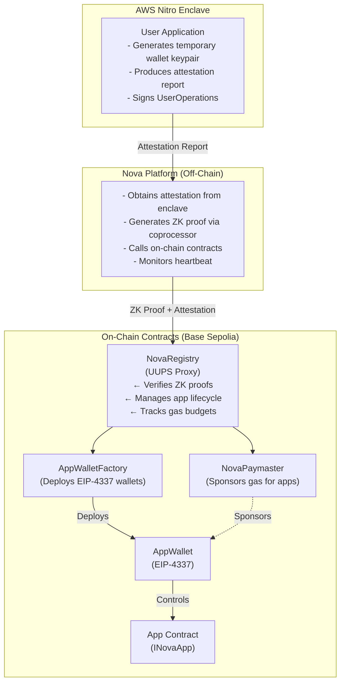
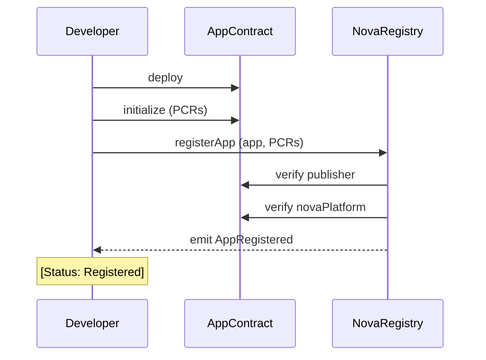
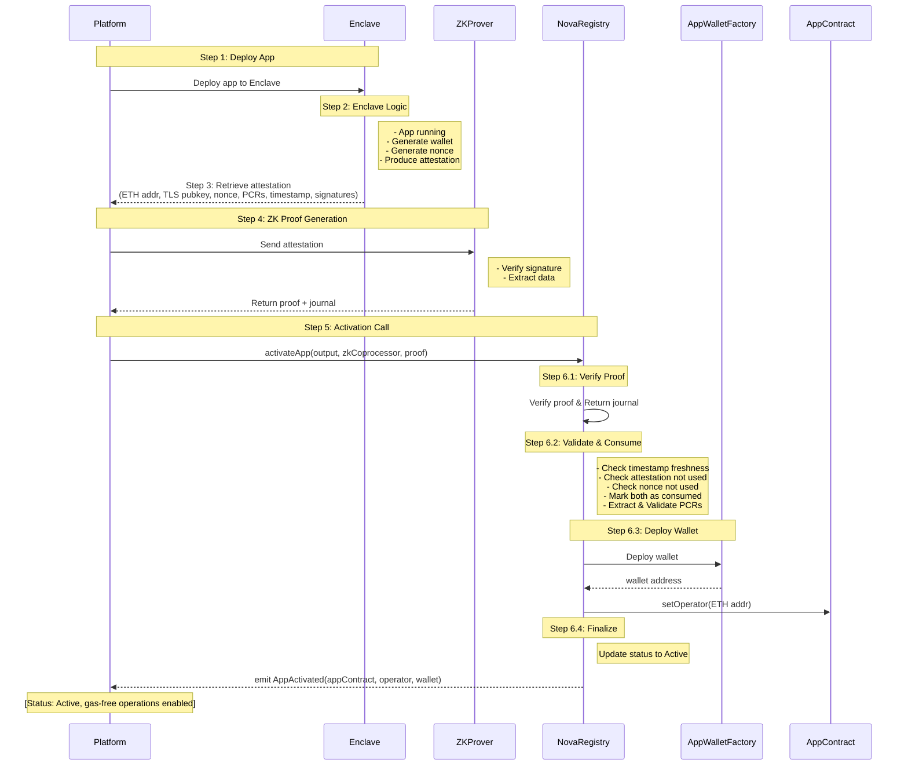
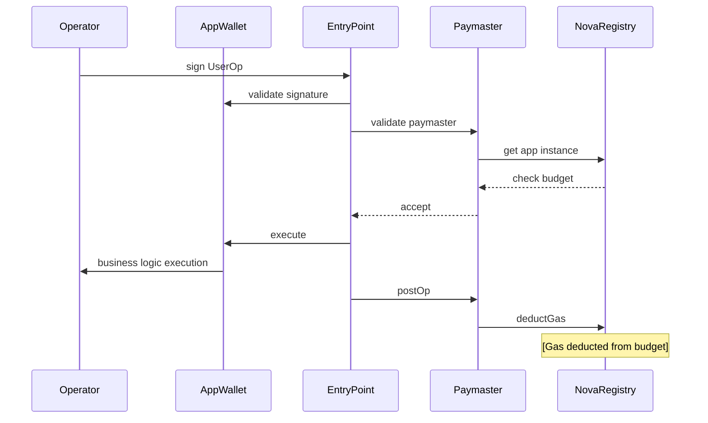
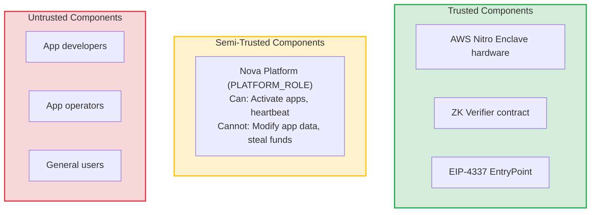
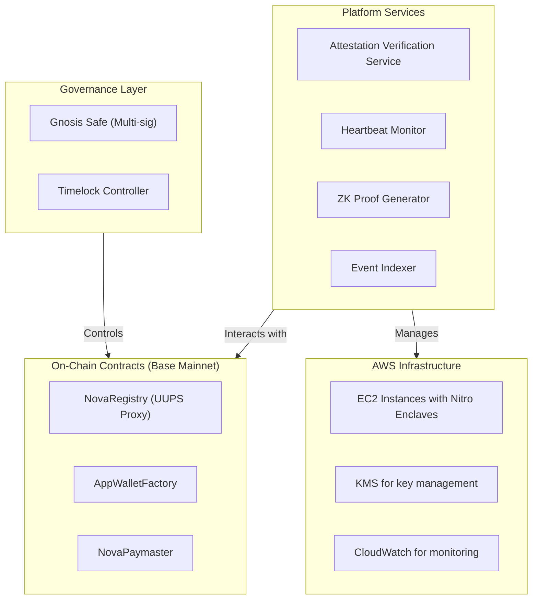

# Nova TEE Platform - System Design Diagrams

This document contains Mermaid diagram representations of the workflows and architecture described in [DESIGN.md](./DESIGN.md).

## Architecture Overview

## App Registration Flow

## App Activation Flow

## UserOperation Execution Flow

## Trust Boundaries

## Deployment Topology

